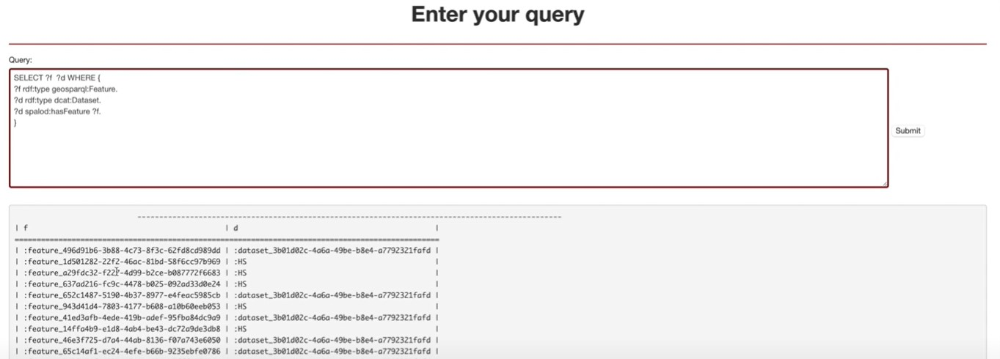
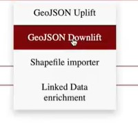

  Here we will show you how to Downlift a file in GeoTime

## Step1 :
So once again go to the data management tab , but this time select GeoJSON Downlift

## Step2 :
Now select the URI you want to Downlift

And click on the Downlift button.

GeoTime Wiki [GeoTime](../GeoTime_Wiki.md)
