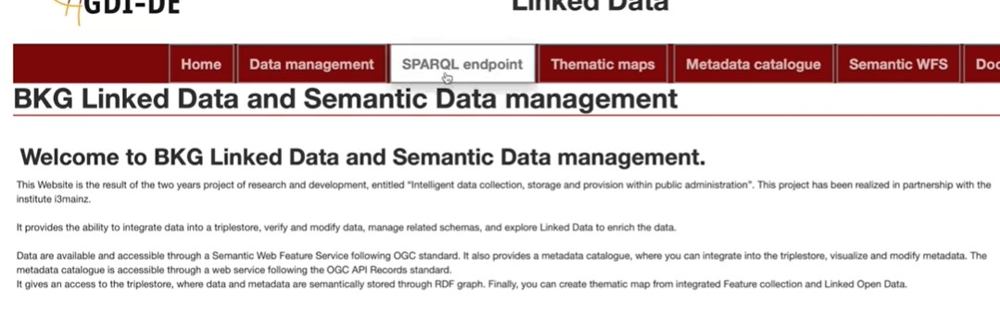
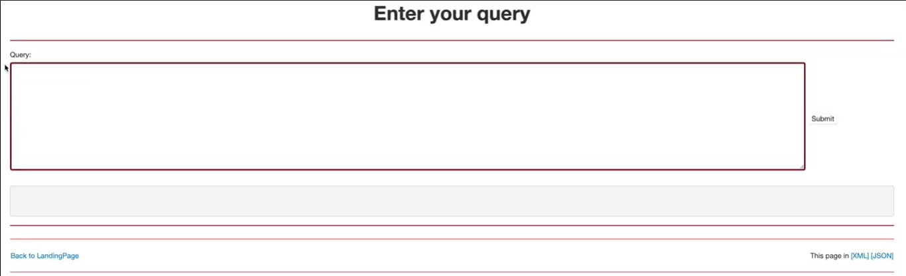
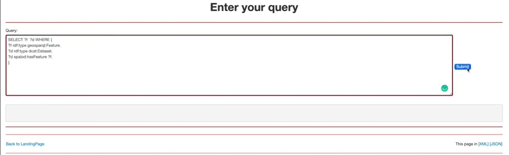

# SPARQL

## Step 1 :

Now we are going to show you how to retrieve information from the ontology , in this first step you will have to locate and click on SPARQL endpoint

## Step 2 :

After clicking on SPARQL endpoint you will be redirected to the « Enter your query page ».

In the Query box (the one below « Query : ») just enter your query and click on the submit button.

## Step 3 :
You can fully customize your query according to the ontology vocabulary.

Your results will displayed below the query box.

GeoTime Wiki [GeoTime](../GeoTime_Wiki.md)

Here's a short video so that you can have a visual and oral explanation :

[sparql endpoint ](https://www.youtube.com/watch?v=J-8c6wWu7Bs&list=PL3We9TPZ7wgL_idQDAoR3vvYemEmzh0jG)
