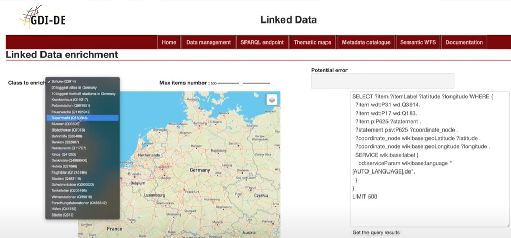
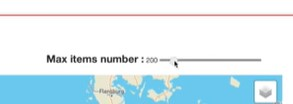

Here you will see how to use our thematic maps functionality

##Step1
First go on the thematic maps tab and select create thematic maps

##step3
You then will be redirected to this page

so as you can see this page has a lot of features  let's go through them

you will find a map on the right and a box for your dynamic queries on the left

 on top left of the map there is a button that if clicked on will give you a list of different query examples

 

and on the top left you will see a toggle button which allows you to choose the number of items you want to appear on the map.

##step3
