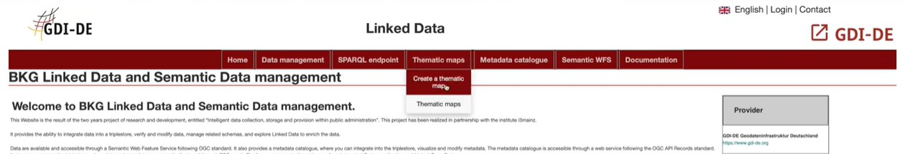
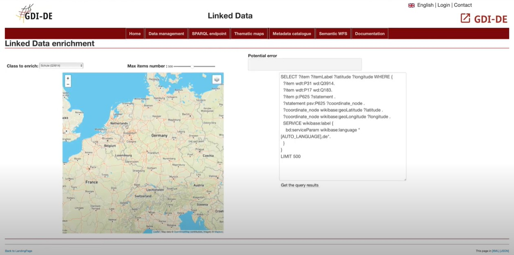
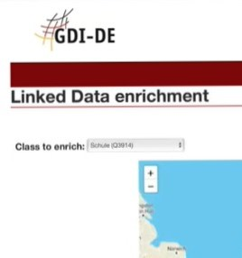
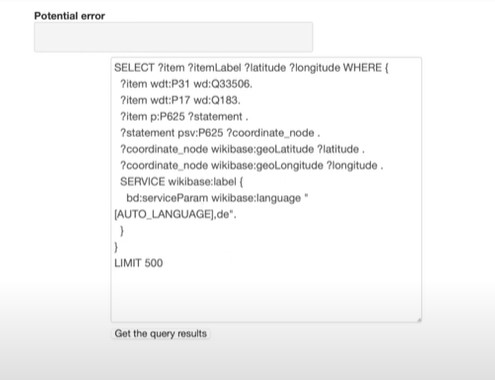
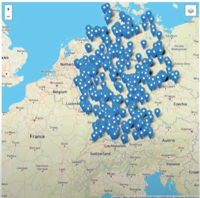
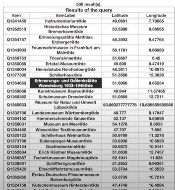
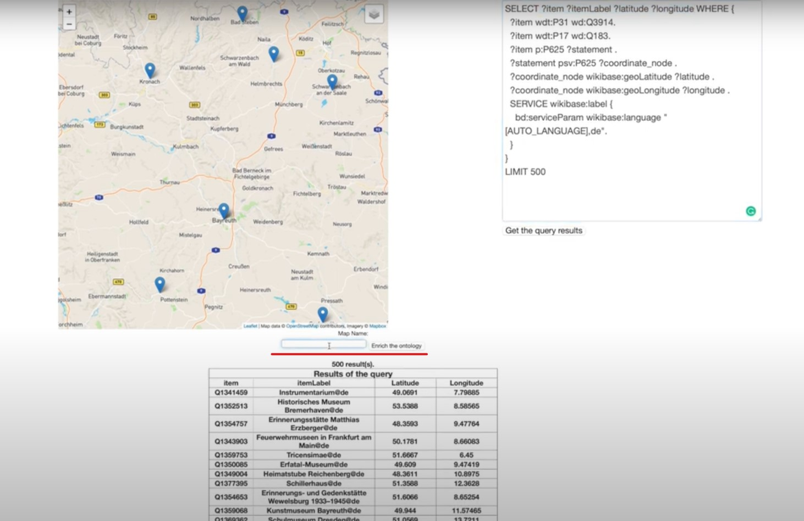
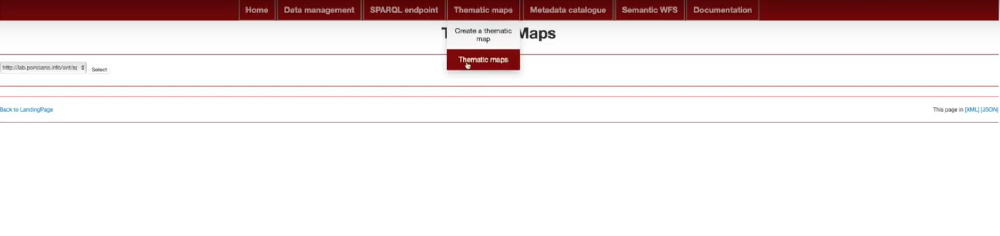
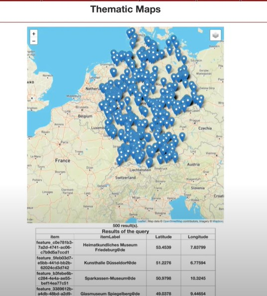

Here you will see how to use our thematic maps functionality

##Step1
First go on the thematic maps tab and select create thematic maps

##step3
You then will be redirected to this page

so as you can see this page has a lot of features  let's go through them , you will find a map on the right and a box for your dynamic queries on the left

 on top left of the map there is a button that if clicked on will give you a list of different query examples

 

and on the top left you will see a toggle button which allows you to choose the number of items you want to appear on the map keep in mind that the higher the number you choose the slower the process will be.

##step3

Now click on "Get the query results"

if you have successfully done steps 1 ,2 and successfully clicked on the forementioned button you wil notice that the map has changed,

the map pinpoints all of the location you wished to find with your query , on the bottom part of the page a table will appear it's purpose is to summarize all of criteria you selected in your query.

##step4

You can also enrich your ontology by giving your query a name in the "enrich ontology" window

Then go to the Thematic maps tab and select Thematic maps

 and just select the map that you have already created

 

 now you can just admire the result

 

Here's a short video so that you can have a visual and oral explanation :

 [ Thematic maps](https://youtu.be/f58nZVhrcGQ?list=PL3We9TPZ7wgL_idQDAoR3vvYemEmzh0jG)
