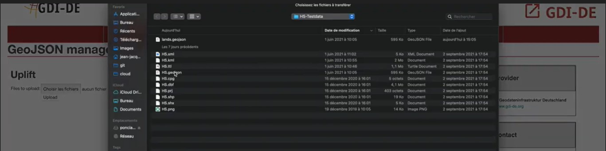

Here we will show you how to uplift a file

## Step 1 :
The first thing you need to do is to locate the data management tab and in that tab select GeoJSON Uplift.

## Step 2 :
After clicking on ‘’GeoJSON Uplift’’ you will be redirected here :

You then just have to click on "choose the file" and to click on the file you want to integrate and click on upload to integrate your file.

## Step 3 :
Congratulations you made it !
You now have the possibility of downloading the ontology  to do so just click on ‘Download file.

We recommend that you use Protégé to visualize the ontology , but any other ontology editor will do.

GeoTime Wiki [GeoTime](../GeoTime Wiki.md)
